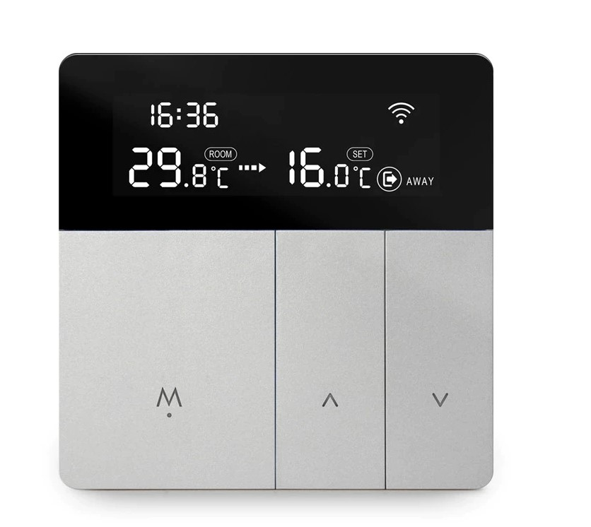
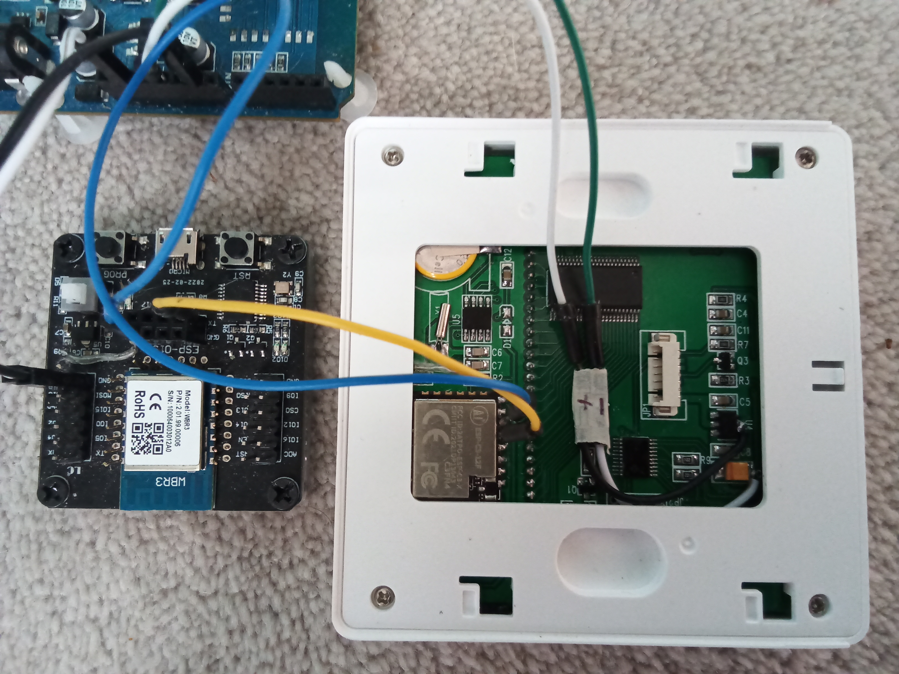
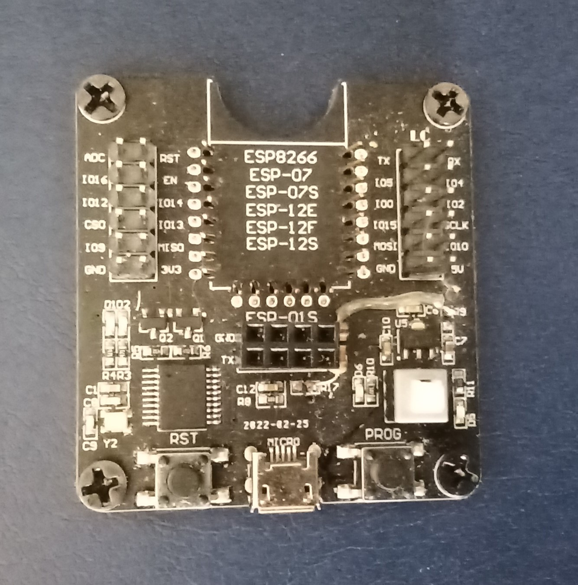
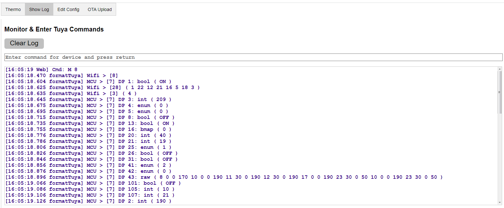

# ESP32-Tuya_Device

Tuya is a company that provides Wifi modules and a cloud infrastructure to allow other manufacturers to upgrade their devices to be IOT capable. The Wifi module was originally based on the ESP8266 but Tuya now use their own WBR3 module with the same dimensions and pinout. The Espressif ESP32-C3FN4 module containing an ESP32-C3 is designed to be pin compatible with the ESP8266, so is also compatible with the WBR3 (or other pin compatible Tuya modules).

The WBR3 Wifi module provides a web interface to the device MCU which controls the device operation and its display if present. They communicate over a UART connection
using the [Tuya serial protocol](https://developer.tuya.com/en/docs/iot/tuyacloudlowpoweruniversalserialaccessprotocol?id=K95afs9h4tjjh), which needs to be understood to use this app.

To avoid having to use Tuya's own cloud based app, this app replicates the serial protocol on the WBR3 module using an ESP32-C3 and provides a web server for local control of the device.

### Only use this app if you understand the Tuya technical documents, and are familiar with coding and electronics, and can fix issues yourself

## Design

The app works in two modes:
* Sniffer - the ESP32-C3 sits between the device MCU and the WBR3 module to identify how the Tuya serial protocol is being used.
* Controller - the ESP32-C3 takes the place of the WBR3 module implementing the device specific Tuya serial protocol, in this case an Avatto Tuya i8HGB-Wifi Thermostat.

### Sniffer Mode
The device needs to be opened up and the WBR3 module heat gunned off the board, and the ESP32-C3FN4 module soldered in its place, **after** it has been programmed with the app to allow subsequent changes to be made via OTA. Temporary jumpers need to be added to provide a 5V supply to the device and to connect UART1 on the ESP32-C3 (any two convenient pins) to UART0 on the WBR3.  

The WBR3 module needs to be placed in an ESP8266 code burner and the jumpers from ESP32-C3 connected to the TX and RX pins (UART0 TX -> UART1 RX etc). Do not power the code burner via USB port or the UART bridge chip will interfere with UART0. Supply power directly to the 5V and GND headers. Ensure that there is a common ground between the device and code burner power supplies. .

  

When the device wakes up, it will output all of its current DataPoint values which will be shown on the sniffer web page - `TSN.htm`, see below.
For each DataPoint, the output format is:
* source > [command] DP id: data type ( value )

 

Use the Tuya App to send commands to the device to request all data points. For each command sent, note the output on the Sniffer log, to match up the DataPoints, eg DP 2 is the target temperature * 10. Each command will cause the WBR3 module to output a particular DataPoint to the device. Continue sending commands until each DataPoint has been identified.

### Controller Mode
Once this app has been configured with the specific Tuya DataPoints for the device (as in `appSpecific.cpp`), the jumpers can be removed and the device reassembled. The controller uses the device specific web page, in this case `Thermo.htm`.

## Installation

Download GitHub files into the Arduino IDE sketch folder, removing `-main` from the application folder name.

Select the required module, eg `ESP32C3 Dev Module`.
Compile using arduino core min v3.1.0 with Partition Scheme: `Minimal SPIFFS (...)`. 

To load the app on the ESP32-C3FN4 for the first time, use a pin compatible ESP8266 Code Burner shown in image above, connecting the IO15 header (for pin GPIO8) to 3V3. 

On first installation, the application will start in wifi AP mode - connect to SSID: **ESP-TuyaDevice_...**, to allow router and password details to be entered via the web page on 192.168.4.1. The configuration data file (except passwords) is automatically created, and the application web pages automatically downloaded from GitHub to the flash **/data** folder when an internet connection is available.

Subsequent updates to the application, or to the **/data** folder contents, can be made using the **OTA Upload** tab. The **/data** folder can also be reloaded from GitHub using the **Reload /data** button on the **Edit Config** tab.

## Configuration

The Tuya Device web page **Edit Config** tab has the following buttons:

* **Wifi Config**: WiFi and webserver settings
.
* **Save**: Make configuration changes persist over ESP reboots.

* **Reboot ESP**: Restart the ESP to apply some configuration changes.

* **Reload /data**: Reload the **/data** folder contents from GitHub.

* **Clear NVS**: Clear current passwords.

